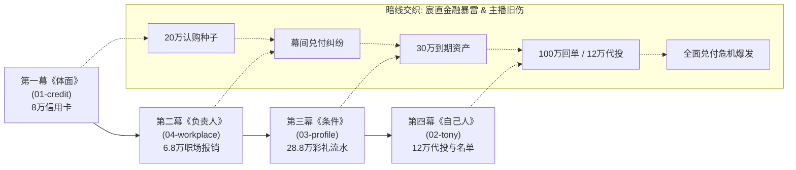

# 《深夜热线：直播间侦探》全维度综合重估与发行建议报告

> **评估基线**：`steam-demo-01` (2026-09)\
> **涉及范围**：剧情架构、台词文本工程、核心玩法循环、UI与交互设计、BGM与音频管线、前端代码与测试工程\
> **核心结论**：本作具备当今独立游戏市场罕见的**顶级现实议题穿透力**与**高度自律的工业化文本工程体系**。在核心概念（“事实脱水”、“已证/修剪/未知”三界划分）与底层测试管线上已达行业标杆水平；主要短板在于**配音资产的真实落地**、**样式单体（1.1万行CSS）维护性**以及**长盘游玩中的交互形式多样性**。

---

## 目录

1. [综合评估雷达与核心指标](#1-综合评估雷达与核心指标)
2. [剧情深度解构：现实镜像与暗线咬合](#2-剧情深度解构现实镜像与暗线咬合)
3. [台词文本工程：生活质感与严格因果](#3-台词文本工程生活质感与严格因果)
4. [玩法机制评估：事实边界脱水与交互瓶颈](#4-玩法机制评估事实边界脱水与交互瓶颈)
5. [UI 与交互体验：控制台审美与层级挑战](#5-ui-与交互体验控制台审美与层级挑战)
6. [BGM 与音频系统：动态声景与人声定海神针](#6-bgm-与音频系统动态声景与人声定海神针)
7. [代码工程与架构：极高素养与重构建议](#7-代码工程与架构极高素养与重构建议)
8. [Steam 发行冲刺执行清单](#8-steam-发行冲刺执行清单)

---

## 1. 综合评估雷达与核心指标

| 维度 | 评分 (1-10) | 现状优势 (Strengths) | 现存瓶颈与风险 (Bottlenecks) |
| :--- | :---: | :--- | :--- |
| **剧情 (Plot)** | **9.5** | 严肃解构当代都市隐性成本转嫁；四案“起承转合”与“宸直暴雷”暗线环环相扣。 | 连续四案情绪强度高，中段缺乏物理呼吸感与节奏缓冲。 |
| **台词 (Script)** | **9.2** | 彻底杜绝 AI 腔与法庭装腔作势；拥有严格的相邻回合逻辑因果校验。 | 强因果审查导致部分节点“正解导向”明显，分支探索略显收紧。 |
| **玩法 (Gameplay)** | **7.8** | “听陈述-找漏洞-圈凭证-判边界”逻辑自洽；“事实三界”极具行业辨识度。 | 交互多集中在“点击选项/文本圈点”，玩法形态偏向视觉小说，缺乏主动联想拼接。 |
| **UI / 交互 (UI/UX)** | **8.2** | 沉浸式暗夜直播控台；全键盘与手柄（Gamepad）无障碍导航极强；凭证拟真度高。 | `styles.css` 达 11,400+ 行，单体维护风险极高；高DPI/掌机多物证并列容易视觉拥挤。 |
| **BGM / 音频 (Audio)** | **8.4** | 动态音频总线分轨；`pressure-stem` 情绪无缝升压；Web Audio 合成音兜底完善。 | 关键口供语义语音（Voice）大多仍为占位或规划，电台灵魂极度依赖演员实际临场演技。 |
| **代码工程 (Code)** | **8.8** | 零运行时依赖（原生 ESM）；110 个纯逻辑单测；Playwright 端到端浏览器冒烟健全。 | `app.js`（1300+行）与 `state.js` 承担了过多粘合职责；大尺寸单体 JSON 缺乏可视化编辑工具。 |

---

## 2. 剧情深度解构：现实镜像与暗线咬合

### 2.1 四幕主案的“起—承—转—合”



* **第一幕《体面》（`01-credit`，八万元信用卡与共同消费）——【起：确立基石】**
  * **题眼**：体面。
  * **戏剧矛盾**：男方隐瞒失业，用借款与信用卡维持高消费恋爱假象，最后将八万账单推给女方；女方借直播试图证明“自己一分钱也不该出”。
  * **事实脱水**：拆解出约四万共同排场、约五千男方自用男装、一万二女方专属设备；女方14个月半薪24.5万实际已耗尽只剩1.16万。
  * **核心立意**：确立全剧法则——“累计给付不等于当前余额；经济压力不能替签字人免责；双方动机都不改变资金与物证边界”。
* **第二幕《负责人》（`04-workplace`，六万八垫款与正式报销）——【承：程序与异化】**
  * **题眼**：负责人。
  * **戏剧矛盾**：职场新人陈某为争取城市招商活动“执行主责”署名，在同事诱导下主动申请临时提额垫付6.8万；同事拿“活动立项审批通过页”冒充“报销通过页”，拖延三个星期。
  * **事实脱水**：14:05 公开报备流程与 14:22 私聊指令相反；陈明知规则仍亲手删去预算追问；立项页不等于报销单；三层供应商返费（招商主管/区域经理/采购经办）浮出水面。
  * **机制咬合**：首次引入平台“强制贴片”与流量惩罚，将“坚持公开原话需要付出职业代价”实装进玩法。
* **第三幕《条件》（`03-profile`，二十八万八彩礼与局部流水）——【转：双向升压】**
  * **题眼**：条件。
  * **戏剧矛盾**：相亲女方父母误将男方的自费 MBA 当作深厚家底，得知真相后不退反加价，借口“给女儿安全感”开出 28.8 万彩礼与婚后管账要求；男方反击只交出工资卡流水，隐瞒其他投资。
  * **事实脱水**：女方并非加价的无辜旁观者；拆分彩礼、当前现金、父母留赠与婚后六万；高额打赏弹幕试图当场购买话语权。
  * **核心立意**：将婚姻里的“身份溢价”与“资产控制”当场核算；金钱可以协商，但不能用虚构的道德标签进行成本转嫁。
* **第四幕《自己人》（`02-tony`，裁过的名单、敲门声与十二万代投）——【合：整晚峰值】**
  * **题眼**：自己人。
  * **戏剧矛盾**：何某享受理发店 Tony 的外貌、专属照顾与晚档服务，听闻高息理财后主动拿出12万委托 Tony 走私人账户代投；出事后将女客名单裁去金额栏，包装成纯粹的情感诈骗寻求同情。
  * **事实脱水**：敲门的是警察（抓捕其高利贷借款人）；12万是何某因够不上百万门槛主动要求代投；Tony 既无代客理财资质，又拒不出示真实产品合同。
  * **剧情收网**：与第二幕的6.8万（有正规公司发票）并列，提示玩家虽然同为“追钱”，凭证状态却有天壤之别；随后引爆宸直危机新闻与平台商务函。

### 2.2 宏观暗线与主角林旭阳的宿命闭环
* **咖啡厅序章的教学与铺垫**：林旭阳与妻子赵律师在开播前介入当事人离婚财产与亲子疑点，通过核验订单、流水出示与咬胶委托初检，让玩家亲身体验“专业程序、拒绝猜测、克制停顿”，奠定了全剧的主角人设。
* **宸直系金融危机的暗流**：并非背景板，而是穿透四案的血脉。从早期的资金吸纳、共享科技的虚假扩张，到最后阶段的高利贷收紧与兑付崩盘，映射出宏观泡沫下微观个体的挣扎与算计。
* **主角的职业伤痕与抗争**：林旭阳两年前因被修剪过的账单误导造成误判；在当代直播间充斥着“情绪判决秀”与“对立流量”的环境下，他坚持“听完整、核材料、守边界”。游戏赋予了这种克制以现实沉重感——坚持原则会面临下播限流与商务惩罚。

---

## 3. 台词文本工程：生活质感与严格因果

### 3.1 绝无 AI 腔与文饰的当代口语
台词具备极强的心理防御性与阶层语境：
* **陈（案二）的逃避型口吻**：“*呃……其实就是说，活动马上就要开始了嘛。*”口癖在被逼至死角、承诺在群里公开追款时彻底褪去，露出原本坚韧的骨偶。
* **何（案四）的受害者修剪话术**：“*他平时叫我都是叫老板娘的……你看这名单，全是他鱼塘里的客人。*”用亲昵代称掩盖12万主动追求高息代投的投机本质。
* **林旭阳的干脆与不落套路**：“*你转了吗？*”、“*八万。*”、“*什么时候还？*”、“*没说准。*”不带道德批判，直奔核心利益账目。

### 3.2 严密的相邻回合因果审查（Adjacent-turn Causality）
工程中 `dialogue-adjacency-review.json` 覆盖了全案的每一轮来回对话。每一句追问必须严格锚定上一句话中出现的已知事实、数额漏洞或情绪破绽：
* **严禁前置预知**：玩家没问出的事实，后续台词绝不提前“说漏嘴”。
* **严禁跨度突兀**：禁止为了展示材料而强行打断对方自然倾诉。
* **剥洋葱式口径滑移（The Deception Chain）**：来电人面对质询时，遵循“否认 $\to$ 局部自圆 $\to$ 最小限度让步 $\to$ 守住底线利益”的心理防御模型，使反转极具心理说服力。

---

## 4. 玩法机制评估：事实边界脱水与交互瓶颈

### 4.1 核心玩法循环图解

```
   ┌────────────────────────────────────────────────────────┐
   │ 1. 来电人陈述 (Statement Stage)                         │
   │    全屏大字提示，完整听取第一手情绪化叙述，捕捉隐蔽漏洞        │
   └──────────────────────────┬─────────────────────────────┘
                              ▼
   ┌────────────────────────────────────────────────────────┐
   │ 2. 逐句追问 (Sentence-by-Sentence Interrogation)       │
   │    拆解回放句子，按住单句由主播开口质问；消耗耐心槽        │
   └──────────────────────────┬─────────────────────────────┘
                              ▼
   ┌────────────────────────────────────────────────────────┐
   │ 3. 材料呈堂与圈点 (Decisive Present & Document Mark)   │
   │    并排核验流水、微信记录、审批单，在真实物件上圈划关键行 │
   └──────────────────────────┬─────────────────────────────┘
                              ▼
   ┌────────────────────────────────────────────────────────┐
   │ 4. 麦外白天调查 (Off-air Daytime Investigation)        │
   │    有限行动力取舍，自愿授权获取新材料，不越界非法开盒       │
   └──────────────────────────┬─────────────────────────────┘
                              ▼
   ┌────────────────────────────────────────────────────────┐
   │ 5. 第二夜对质升级 (Overnight Callback)                 │
   │    带入白天新证据打破深层谎言，逼出最终底牌                 │
   └──────────────────────────┬─────────────────────────────┘
                              ▼
   ┌────────────────────────────────────────────────────────┐
   │ 6. 事实三界划分与结案 (Truth Boundary: True/Edited/Unknown) │
   │    不搞道德宣判，输出克制、负责的主播收麦判词              │
   └────────────────────────────────────────────────────────┘
```

### 4.2 核心玩法闪光点
1. **事实三界（True / Edited / Unknown）**：彻底推翻传统侦探游戏“最后必须大团圆/全破案”的虚幻感。承认现实中有些账目就是查不清、有些真相就是停留在未知，给玩家带来极大的心智尊重。
2. **情绪债务系统（Rage-bait Contract）**：直面当代中文互联网直播弹幕的跟风与煽动。玩家用铁证打脸偏激弹幕，获得“纠正受众与拨乱反正”的职业爽感。
3. **撤回保护与低挫败容错（Rewind Mechanism）**：支持回溯上一步选择，避免玩家因单次误操作导致死局，鼓励体验不同推理视角。

### 4.3 玩法现存瓶颈与破局建议
* **痛点 1：解题路径收敛过窄，探索感偏弱**
  * *现状*：由于严密的相邻因果审查，导致每一步的“正确答案”近乎唯一，玩家容易产生“顺着出题人意图挑选项”的考试感。
  * *建议*：引入**“论据组合槽”**。允许玩家在对质高潮期，自由将两项不同物证（如“转账记录行”与“私聊截图中的时间戳”）拖拽组合，合成新的质询点，给予玩家真正的推理发现权。
* **痛点 2：逐句追问的反馈粒度略平**
  * *现状*：点中无效句子只有冷冰冰的「耐心 -1」，缺乏足够的人物微反应。
  * *建议*：即便是无效追问，来电人也应给予符合心理防线的应激微词（如“主播你问这个干嘛？”“这不是很正常吗？”），既维持了耐心扣除惩罚，又充实了对话质感。

---

## 5. UI 与交互体验：控制台审美与层级挑战

### 5.1 视觉设计系统
* **基底色盘**：
  * 主背景底色：`#111410`（冷黑墨色）搭配微妙的 `28px` 点状网格暗纹。
  * 主高亮色：`--accent: #65d6c2`（荧光薄荷青）、`--gold: #d4b46a`（温润暗金，用于高价值凭证）。
  * 警告/警戒：`--rose: #b16a73`（收敛的干枯玫瑰红，代替刺眼的亮红）。
* **拟物物证设计**：
  * 银行对账单的走纸边框、微信聊天的气泡与时间差、发票抬头的印章与编号校验，均具备高度逼真的现实质感。

### 5.2 交互与输入体系
* 具备完善的键盘与手柄导航控制器（`src/ui/focusInputControl.js`），支持游戏手柄轮询，UI 焦点高亮带有呼吸动效（`focusCurrent`），完美契合 **Steam Deck** 及主机手柄的操作直觉。

### 5.3 UI 优化空间
1. **单一 `styles.css` 达 11,439 行（271KB）**：
   * *问题*：所有全局样式、布局、动效、弹幕、物证板排版均塞在一个巨型 CSS 文件中，无法进行模块化维护，极易发生选择器权重覆盖问题。
   * *建议*：必须拆解为 `@import` 结构（如 `theme.css`、`components/*.css`、`screens/*.css`）。
2. **多屏自适应与信息密度控制**：
   * *问题*：在 16:10（Steam Deck 800p）或小屏笔记本上，当“物证查看板”、“对话流水”和“连线控制台”并列时，可视空间被严重压缩。
   * *建议*：引入物证板的“沉浸式全屏展开/局部画中画放大镜”功能。

---

## 6. BGM 与音频系统：动态声景与人声定海神针

### 6.1 音频架构亮点
* **四总线设计**：`bgm`、`ambience`、`sfx`、`voice` 四个总线独立分流，支持各自独立的音量记忆与平滑 Ducking（语音出现时，BGM 自动下压 3-6dB）。
* **动态压力分轨（Dynamic Stems）**：
  * 对质常规阶段播放 `live-call.ogg`；
  * 进入撕扯质证阶段，无缝混入 `pressure-stem.ogg`（高频脉冲与低频心跳声），不切换主旋律，极大地增强了对质压迫感。
* **合成音健壮兜底**：使用 Web Audio API 内置了 `readySynth`，即使在离线无外部音效素材时，UI 与对质命中音依然可用。

### 6.2 商用上线关键卡点：语音（Voice）
* **现状**：目前除案二的吹风机录音使用了 macOS Tingting 合成混音 Demo 外，其余高光台词仍为 `planned` 状态。
* **关键建议**：
  1. **连麦类游戏，人声就是第一叙事载体**：玩家的核心体验是通过声音的破绽（呼吸急促、抢话、停顿、吞咽、背景环境杂音）产生怀疑。
  2. 严格依照 `docs/audio-recording-handoff.md` 与 `recording-manifest.json`，寻找专业配音演员完成真人声源录制，并在音频管线中加入**真实的手机网络通话带通滤波（Bandpass Filter 300Hz-3400Hz）与麦克风底噪**。

---

## 7. 代码工程与架构：极高素养与重构建议

### 7.1 值得赞叹的工程亮点
1. **零运行时依赖（Zero Runtime Dependencies）**：整个游戏基于现代原生 JavaScript（ES Modules）构建，脱离 Webpack/Vite 等重型打包器依然能够秒级运行。
2. **极高密度的自动化测试网络**：
   * **110 个纯逻辑单测**：覆盖从 `CARE`、`PROLOGUE`、`QUICK`、`AUDIO` 到 `DAILY` 轮转的每一处边界。
   * **自动化流程校验**：`verify-narrative-flow.js`、`verify-logic.js`、`check-all.js` 构成了坚不可摧的防回归网。
   * **Playwright E2E 冒烟测试**：支持 headless 浏览器与 Electron 桌面端自动回放通关。

### 7.2 架构解耦与重构建议

```
重构前现状 (Monolithic Bottlenecks):
  src/styles.css        (11,439 行，未拆分单体)
  src/app.js            (1,322 行，路由/状态/输入/装配混杂)
  cases/*.json          (单文件 120-150KB，剧本与元数据混编)

建议解耦方向 (Decoupled Modular Architecture):
  src/styles/
    ├── base.css
    ├── layout.css
    ├── components/*.css
    └── screens/*.css
  src/core/
    ├── appRouter.js       (纯粹处理界面路由与生命周期)
    └── inputDispatcher.js (独立键盘/手柄事件分发)
  tools/storyStudio/       (轻量级剧本/案件可视化校验工具)
```

1. **`src/styles.css` 模块化拆分**：按界面组件与屏幕状态切分为若干子 CSS 文件。
2. **`src/app.js` 职责精简**：目前承担了全局事件绑定、视图装配、路由跳转等过多职责。建议将输入控制分发与屏幕路由抽离为独立服务。
3. **案件 JSON Schema 工具链**：单案 JSON 数据量超 120KB，人工手写维护成本极大。建议维护固定的 TypeScript/JSON-Schema 验证器，为未来扩展 DLC 或创意工坊打下基础。

---

## 8. Steam 发行冲刺执行清单

为确保在 Steam 推出试玩版（Demo）与正式版时收获“特别好评”，建议按以下优先级推进：

### 阶段一：视听质感与演示强化（P0 - 决定首发口碑）
- [ ] **真人实录语音落地**：优先录制四个主案的关键电话语音线索（吹风机、背景敲门声、酒局喧闹、私聊语音回放），替换合成音。
- [ ] **强化“指认击穿”演出**：当玩家圈中铁证并出示成功时，增加视觉震颤、音频 Stinger 重音、弹幕骤停的视听冲击，放大破局成就感。
- [ ] **Steam Deck 专项优化**：适配 1280x800 分辨率，确保掌机端阅读账单材料文字清晰无缩放畸变，手柄震动（Haptics）联动心跳与加压音轨。

### 阶段二：工程解耦与维护保障（P1 - 降低长期维护成本）
- [ ] **样式文件重构**：将 11,439 行的 `styles.css` 拆解为功能模块，保证样式隔离。
- [ ] **控制器瘦身**：解耦 `app.js`，将键盘与手柄交互彻底委托至独立控制器。

### 阶段三：玩法深度与内容外延（P2 - 提升重玩价值）
- [ ] **探索材料自由比对**：在第二夜允许玩家将两份不同材料进行“矛盾并列”。
- [ ] **丰富结案后余味**：在收麦后的未读消息（Epilogue Unread）中，展现更多宏观世界因主角的克制而产生的连锁反应（如平台整改、行业讨论、当事人的后续选择）。

---

*报告生成归档于 `docs/steam-demo-01-comprehensive-evaluation-2026-09.md`。*
